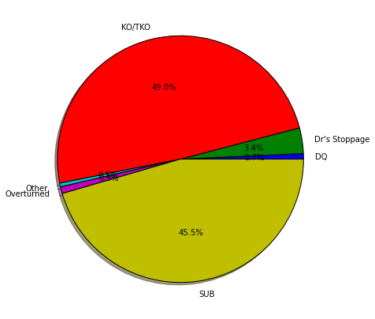
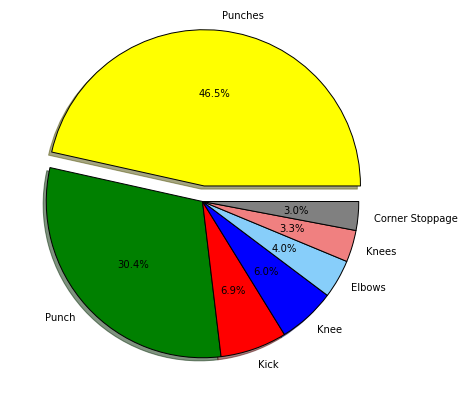
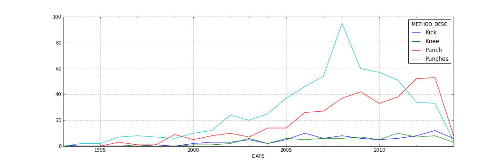
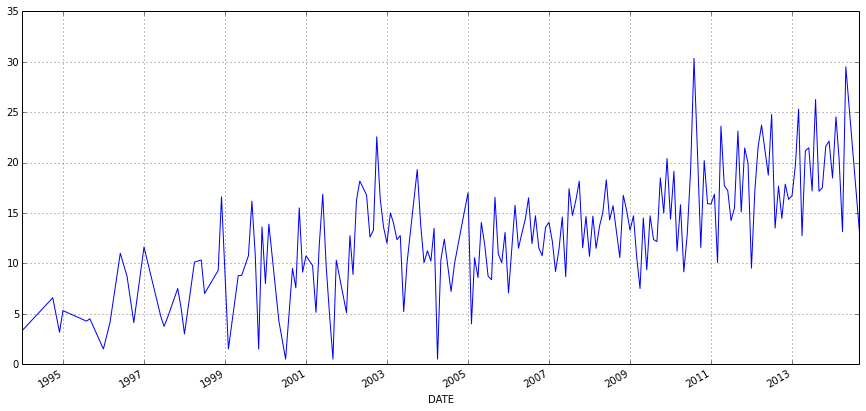
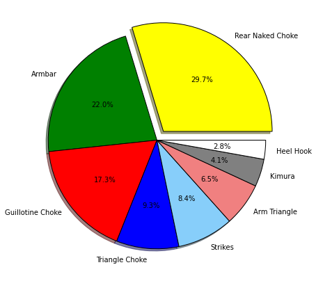
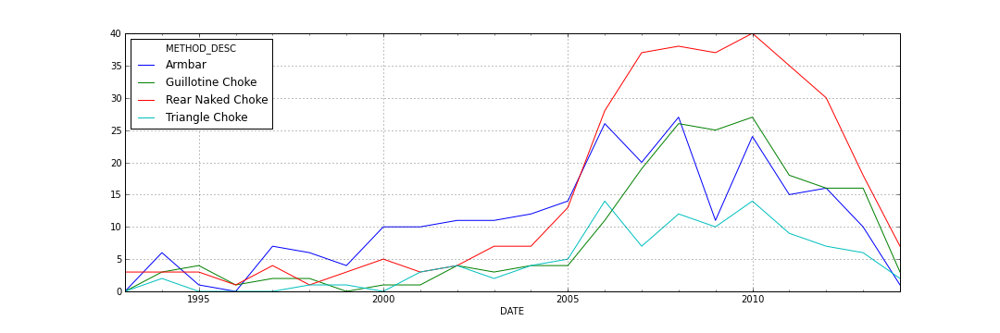
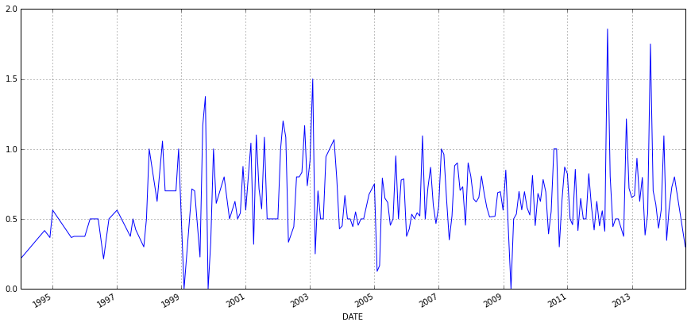

Добрый день, уважаемые читатели.

Сегодня я хочу поделиться с вами результатами моего мини-исследования на тему какие приемы чаще всего приносят победу в смешанных единоборствах. Тема была выбрана не случайно, т.к. всегда возникает много споров на предмет того что лучше бокс, тайский бокс, борьба и т.д.

Для анализа было взято 4660 боев, начиная с 1991 года, которые проводились под эгидой промоушена UFC. 

### Общий анализ боев

Для начала посмотрим, на общее распределение результатов боев за всю историю:

Из приведенной диаграммы можно заметить, что практически половина побед одерживается нокаутами (1474 боя), в то время как на победу болевыми приемами приходится около 45% (1286 боев).

### Распределение побед за счет ударной техники

Для того, чтобы понять какие из ударов чаще всего приносят победу взглянем на следующую диаграмму:

Из нее видно, львиная доля побед одерживалась за счет **добивания руками** (Punches), также 1/3 боев заканчивалась в результате **нокаутирующего удара** рукой. Так же можно заметить, что нокаут в результате ударов ногами происходил всего лишь в 10% процентах случаев (88 боев за всю историю).

Посмотрим как распределяется динамика ударов во времени:

На графике можно заметить, что количество побед одержанных добиванием или нокаутами резко возрастает в 2008 г, как мне кажется, это может быть связано с тем, что как раз в это время UFC купил японский промоушен PRIDE и все топовые бойцы последнего перешили в UFC, что привело к увеличению количества боев.

Также стоит обратить внимание на то, что после того, как в UFC перестали биться голыми руками, общее количество ударов начало планомерно расти, это можно наблюдать из ниже приведенного графика:

### Распределение побед одержанных болевыми приемами

Посмотрим теперь на распределение болевых приемов:

Из диаграммы видно что чаще всего победу помогают одержать удушение сзади, рычаг и гильотина. Ярко выраженного лидера среди этих приемов нет, в отличии от предыдущего пункта с ударкой.

Покажем динамику применения болевых приемов:

Из графика видно, что их количество также возрастает в 2008 году, причины этого я указывал выше. Но стоит отметить одну интересную особенность, что до 2006 года *лидирующее место среди болевых* занимал **рычаг**, в то время как после на первое место со значительным отрывом вышло **удушение сзади**, а после 2008 года рычаг обогнала и гильотина. 

Если посмотреть на динамику применения болевых, то она колеблется в пределах одного уровня, в отличии от ударов, у которых был виден явный возрастающий тренд:

